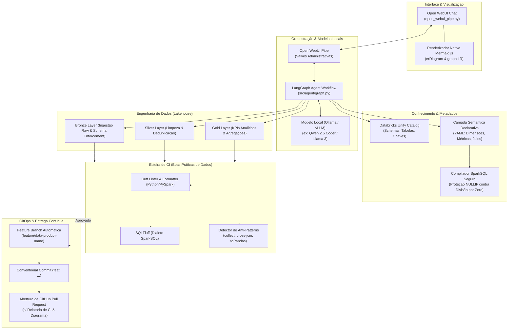
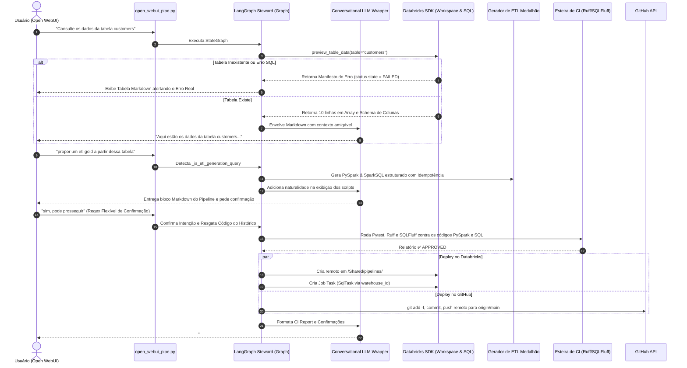

# Databricks Steward Agent

[](https://www.python.org/downloads/)
[](https://docs.databricks.com/en/dev-tools/sdk-python.html)
[](https://github.com/langchain-ai/langgraph)
[](https://openwebui.com/)
[](https://podman.io/)

**Databricks Steward Agent** é uma solução completa de governança, modelagem semântica, engenharia de dados Lakehouse e automação GitOps orientada a GenAI. Projetado para integrar perfeitamente com **Open WebUI** e modelos de linguagem locais (**Ollama / vLLM**) através de orquestração com **LangGraph**, o agente se conecta ao Databricks (Unity Catalog & SQL Warehouse), gera diagramas Mermaid interativos, desenha produtos de dados, gera pipelines modulares em PySpark/SparkSQL, valida o código em uma esteira de CI de boas práticas de dados e abre Pull Requests automaticamente no GitHub.

---

## 🏛️ Diagramas de Solução e Arquitetura

### 1. Arquitetura Geral da Solução



---

### 2. Diagrama de Sequência Ponta a Ponta

O fluxo abaixo ilustra a interação completa do usuário desenhando um produto de dados e publicando no GitHub:



---

## 🚀 Principais Funcionalidades

1. **Integração Nativa Open WebUI**: Script `open_webui_pipe.py` pronto para importação direta com painel de **Valves** administrativas.
2. **Modelos Locais via Ollama / vLLM**: Opera 100% local e privado via protocolo OpenAI-compatível com streaming de respostas.
3. **Databricks Unity Catalog Introspection**: Inspeção automática de schemas, tabelas e chaves primárias/estrangeiras, com **modo de demonstração offline** para desenvolvimento sem cluster ativo.
4. **Camada Semântica Declarativa em YAML**: Definição flexível de dimensões, métricas e regras de negócio com resolução automática de sinônimos.
5. **Compilador SparkSQL com Resolução em Grafo**: Algoritmo BFS para encontrar o menor caminho de JOIN entre entidades e inserção automática de proteção contra divisão por zero (`NULLIF(..., 0)`).
6. **Visualização Interativa com Mermaid.js**: Notação Crow's foot (`erDiagram`) e fluxos de linhagem medalhão (`graph LR`) renderizáveis diretamente no chat.
7. **Geração de Pipelines Medalhão**: Códigos modulares em PySpark e SparkSQL com schema enforcement (Bronze), deduplicação (Silver), agregações analíticas (Gold) e comandos Delta (`OPTIMIZE`, `ZORDER BY`, `VACUUM`).
8. **Esteira de CI de Boas Práticas**: Execução em memória do **Ruff**, **SQLFluff** (`sparksql`) e análise estática contra anti-patterns (ex: `.collect()`, `CROSS JOIN`, `.toPandas()`).
9. **GitOps com Auto PR no GitHub**: Criação de feature branch, Conventional Commit e abertura automática de Pull Request com resumo e checklist de CI.

---

## 🐳 Portabilidade: Docker & Podman

O projeto foi construído para máxima portabilidade em ambientes corporativos e de desenvolvimento local, suportando **Docker** e **Podman** (incluindo modo **rootless** por segurança).

### 1. Detecção Automática com Makefile

O `Makefile` detecta automaticamente se você está utilizando `docker` ou `podman` e configura os comandos do compose:

```bash
# Exibir o mecanismo detectado e todos os comandos disponíveis
make help
```

| Comando | Descrição |
|---|---|
| `make build` | Constrói a imagem da aplicação usando a engine detectada (`docker` ou `podman`) |
| `make up` | Sobe a stack completa (Agent + Open WebUI) em segundo plano |
| `make up-ollama` | Sobe a stack completa + Ollama containerizado (`--profile with-ollama`) |
| `make down` | Para todos os containers da stack |
| `make logs` | Acompanha os logs dos containers em tempo real |
| `make status` | Lista o status dos containers ativos |
| `make test` | Executa a suíte de 131 testes automatizados |
| `make lint` | Valida a conformidade de código com Ruff |
| `make format` | Formata o código automaticamente com Ruff |
| `make run` | Executa o servidor FastAPI localmente na porta 8000 |
| `make clean` | Remove arquivos temporários e caches de build |

---

### 2. Uso com Podman (Rootless)

O container foi projetado com um usuário não-privilegiado (`UID 10001: steward`), atendendo aos requisitos de segurança do Podman rootless.

```bash
# 1. Construir a imagem com Podman
make podman-build

# 2. Iniciar a stack com Podman Compose
podman compose up -d

# 3. Verificar containers em execução
podman ps
```

> **Dica de Rede no Podman**: Para que o container se comunique com um servidor Ollama rodando no host da máquina, o container usa o hostname especial `host.containers.internal`.

---

### 3. Uso com Docker

```bash
# 1. Construir a imagem com Docker
make docker-build

# 2. Iniciar a stack com Docker Compose
docker compose up -d

# 3. Acessar a interface
# Open WebUI: http://localhost:3000
# Databricks Steward API: http://localhost:8000/health
```

---

## ⚙️ Configuração do Ambiente (.env)

Copie o template `.env.example` e ajuste suas variáveis conforme necessário:

```bash
cp .env.example .env
```

```ini
# ===============================================
# Databricks (Deixe em branco para modo Offline Demo)
# ===============================================
DATABRICKS_HOST=https://<workspace-id>.cloud.databricks.com
DATABRICKS_TOKEN=dapi...
DATABRICKS_WAREHOUSE_ID=1234567890abcdef
DATABRICKS_DEFAULT_CATALOG=main
DATABRICKS_DEFAULT_SCHEMA=default

# ===============================================
# Modelo Local (Ollama ou vLLM compatível com OpenAI)
# ===============================================
LOCAL_LLM_BASE_URL=http://localhost:11434/v1
LOCAL_LLM_MODEL=qwen2.5-coder:7b
LOCAL_LLM_API_KEY=ollama
LOCAL_LLM_TEMPERATURE=0.1

# ===============================================
# GitHub GitOps (Auto commit, push e Pull Request)
# ===============================================
GITHUB_TOKEN=ghp_...
GITHUB_REPOSITORY=usuario/repositorio
GITHUB_BASE_BRANCH=main

# ===============================================
# Configurações Semânticas
# ===============================================
SEMANTIC_MODELS_PATH=./configs/semantic_models
DEFAULT_QUERY_LIMIT=50
MAX_QUERY_LIMIT=200
```

---

## 🌐 Como Integrar com o Open WebUI

Existem duas formas simples de conectar o Databricks Steward Agent ao Open WebUI:

### Opção A: Como Pipe Nativo (Recomendado)
1. No Open WebUI, acesse **Painel de Administração** > **Functions / Pipes**.
2. Clique em **Adicionar Nova Pipe (+)**.
3. Copie e cole todo o conteúdo do arquivo [`open_webui_pipe.py`](open_webui_pipe.py).
4. No painel de **Valves** da Pipe, você pode configurar e alterar credenciais do Databricks e parâmetros do LLM local em tempo de execução sem reiniciar serviços.
5. Salve e selecione o modelo **Databricks Steward** no chat!

### Opção B: Como Conexão OpenAI Externa via REST Server
1. Suba o servidor com `make run` ou `make up` (porta `8000`).
2. No Open WebUI, acesse **Configurações** > **Conexões** > **OpenAI API**.
3. Adicione a URL: `http://localhost:8000/v1` (ou `http://databricks-steward:8000/v1` na rede Docker).
4. Salve e use o modelo `databricks-steward`.

---

## 💻 Exemplos de Uso via Python SDK

### 1. Inspecionar Catálogo Databricks
```python
from src.databricks.introspector import introspect_catalog

# Inspeciona catálogo ao vivo ou utiliza o mock offline resiliente
entities = introspect_catalog(catalog="main", schema="default")
for entity in entities:
    print(f"Tabela: {entity.name} | Camada: {entity.layer} | Colunas: {len(entity.columns)}")
```

### 2. Consultar Camada Semântica & Compilar SparkSQL
```python
from src.semantic.registry import SemanticRegistry
from src.semantic.compiler import SemanticQueryCompiler

registry = SemanticRegistry("configs/semantic_models")
compiler = SemanticQueryCompiler(registry)

# Compila métricas de negócio em SparkSQL com JOIN automático
sql = compiler.compile_query(
    entity_name="facilities",
    metric_names=["total_credit_limit", "utilization_rate"],
    group_by_dims=["product_type", "status"],
    filters=["status = 'ACTIVE'"],
    limit=10,
)
print(sql)
```

### 3. Gerar Diagramas Mermaid no Chat
```python
from src.semantic.registry import SemanticRegistry
from src.visualizer.mermaid import generate_er_diagram, generate_lineage_diagram

registry = SemanticRegistry("configs/semantic_models")
domain = registry.get_domain("corporate_credit")

# Diagrama de Entidade-Relacionamento nativo Crow's foot
erd_markdown = generate_er_diagram(domain.entities, domain.relationships)
print(erd_markdown)

# Diagrama de Linhagem Medalhão
lineage_markdown = generate_lineage_diagram(domain.entities)
print(lineage_markdown)
```

### 4. Gerar Pipeline ETL e Validar na Esteira de CI
```python
from src.etl.generator import generate_medallion_pipeline
from src.ci.runner import run_ci_pipeline

# Gerar pipeline Silver em PySpark e SparkSQL
pipeline = generate_medallion_pipeline(domain.entities[0], layer="silver")

# Submeter código à esteira de CI
report = run_ci_pipeline(pyspark_code=pipeline.pyspark_code, sparksql_code=pipeline.sparksql_code)

print(f"Status do CI: {'APROVADO' if report.is_approved else 'REPROVADO'}")
print(report.summary_markdown)
```

### 5. GitOps Automatizado (Auto Branch, Commit & PR)
```python
from src.gitops.github_pr import create_data_product_pr

# Apenas abre PR se o relatório do CI for aprovado
result = create_data_product_pr(
    product_name="credit-facilities-silver",
    files={
        "pipelines/silver_facilities.py": pipeline.pyspark_code,
        "pipelines/silver_facilities.sql": pipeline.sparksql_code,
    },
    ci_report=report,
    diagram_md=erd_markdown,
    dry_run=False,  # Altere para True em testes locais
)

print("Pull Request criado com sucesso:", result.pr_url)
```

---

## 🧪 Suíte de Testes Automatizados
O projeto conta com **369 testes automatizados** cobrindo todas as camadas do sistema, provados em baterias exaustivas (incluindo Mocks do Databricks SDK):

```bash
# Executar todos os testes
make test

# Executar apenas testes de fuzzing e segurança adversarial
.venv/bin/pytest tests/test_adversarial_fuzzing.py -v

# Executar jornada End-to-End via Grafo Conversacional
.venv/bin/pytest tests/test_e2e_journey.py -v
```

---

## 📄 Licença
Distribuído sob a licença **Apache-2.0**.
